## Technical Documentation

> OBJ Transformation and Optimization Tool

This program is a command-line C# application designed to process 3D model stored in [.obj format](https://en.wikipedia.org/wiki/Wavefront_.obj_file#:~:text=The%20OBJ%20file%20format%20is,of%20vertices%2C%20and%20texture%20vertices.) and apply several geometric and topological cleanup operations on the model and generate a new, optimized `.obj` file. To view the resulting 3D model using the open-source 3D modeling application *Blender*, the path to the *Blender* application executable file will be provided as a command-line argument. Otherwise, the program will create the output file but will not preview the result.

### External Libraries
To avoid manual parsing logic, the progam uses external `CommandLine` library.

### High-Level Program Architecture

Firstly, the program takes and parses the command-line arguments using the `OBJProcessorArgsParser`, which is implemented with the help of `CommandLine` library. After argument parsing, the core program unit `OBJProcessorProgram` takes arguments and starts reading, processing and then writing the `obj` file.
The program reads the `.obj` file using the `OBJDataReader` class and then stores the data in the `MeshData` class. The `MeshData` object is then processed with `MeshOperations` and written to the output `.obj` file using the `OBJDataWriter` class.

### Data Flow Diagram

### Program Components

* **OBJProcessorProgram** class encapsulates `MeshData` and `OBJProcessorArgsParser` as fields and defines core functionality of the program, including `LoadMeshData`, `CreateOutputFile`, `ProcessMeshData` and `PreviewOutputMesh`. 

* **MeshData** class is a container for storing geometric data parsed from `.obj` file. It encapsulates thread-safe collections of `MeshVertex`, `Face`, normal vectors a uv-coordinates.

* **MeshVertex** class represents a vertex by encapsulating its position and the list of faces it is incident to.

* **Face** class represents a face by encapsulating thread-safe collection of `VertexData`.

* **VertexData** class stores iformation about a vertex, including its vertex index in the list of vertices maintained by `MeshData`, nullable normal index in the list of normal vector in `MeshData` and nullable uv-coordinate index in the list of uv-coordinates in `MeshData`.

* **OBJDataReader** class maintains a list of data builders, which are responsible for reading, parseing and storing specific types of data to the `MeshData` object.

* **DataBuilders** are objects responsible for parsing and storing data to the `MeshData` object. `OBJDataReader` reads a line from the file, and each data builder checks whether the line starts from the approptiete flag. If is does, the builder parses line, and store the data to the `MeshData` object.

* **MeshOperations** are extention methods for `MeshData`, which apply operations by processing vertices and faces in parallel. 
`MeshTransformation` class provides methods for generating transofrmation matrix and includes method for parallel multiplication of vertices positions by a transformation matrix.
`TopologyCleanup` provides extention methods such as`RemoveIsolatedVertices` and `RemoveFacesWithZeroArea`. `RemoveIsolatedVertices` iterates through the vertices in parallel and removes vertices with no incident faces. `RemoveFacesWithZeroArea` iterates through faces in parallel, calculate their area, and removes faces with zero area.
`MeshNormalizatio` computes a transofrmation matrix based on bounding box of the 3d model and applies it to each vertex, scaling and translating the model to fit within a unit cube.

* **OBJDataWriter** class maintains a list of data writers, which are responsible for writing specific types of data to the output `.obj` file. Since an `.obj` file consists of a list of vertices, uv-coordinates , normals and faces, each vertex must have a specific position in the file becouse faces reference their indices. Consequently, removing vertices requires recalculating the vertex indices used in face specification. For this purpose,the `DeletionSynchronization` class is created. It is passed to the constructor of a data writer to recalculate the indices of the specific vertex referenced by face.

* **DeletionSynchronization** class is shared between data writers to coordinate the deletion of specific vertices. Since vertex ordering is crucial, no data is physically removed from the `MeshData` object, instead, deleted vertices are set to null. The `DeletionSynchronization` maintains a list of integers corresponding to the vertices. When a vertex is set to null during program execution, it is not written to the ouput file, besides `DeletionSynchronization` object updates its list so that the `FaceDataWriter` can recalculate the indices of the vertices referenced in face definitions.

### Unit Tests

The program is tested where it is most meaningful. A large portion of the tests focus on the data readers and data writers. In contrast, operations such as normalization and transformation are tested manually by processing and previewing the 3D model, since it is difficult to predict the exact position of a specific vertex in 3D space after transformation.

### Output Model Preview

The project includes the *Python* script `run_blender_with_obj.py`, which is executed at the end of program to preview the output `.obj` file. The script opens *Blender*, cleans the default scene and imports the output 3d model. This functionality requires the path to the *Blender* `.exe` file to be provided as a command-line parameter, otherwise, the preview will not run.

### Notes and Suggestions

The additional mesh operations were specified in the program [Specification](Specification.md). Those operations were not implemented due to the limited time avaible for the project and the overall complexity of the program, even without them. Nevertheless, the program is structured to remain compatible with future extensions, so new functionality can be added easily if needed.

### Conclusion

This projet provides a strucutred and extensible approach for processing and optimizing 3D models in the `.obj` format. Core functionality such as reading, transforming, cleaning, and writing meshes is supported by automated tests, while complex operations are validated manually. Although some advanced operations were not implemented due to time constraints, the architecture is designed to accommodate future extensions with minimal effort.