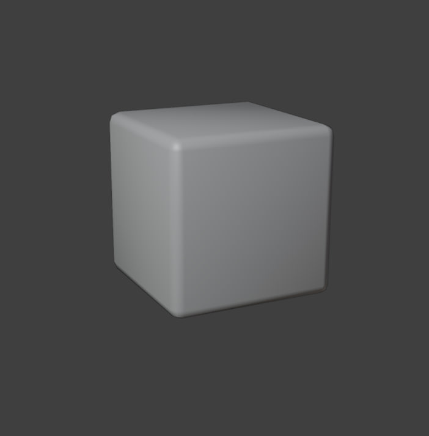
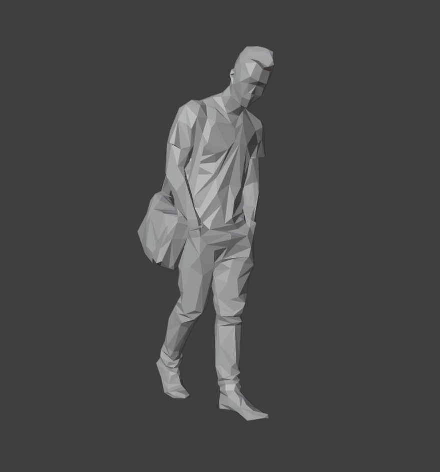
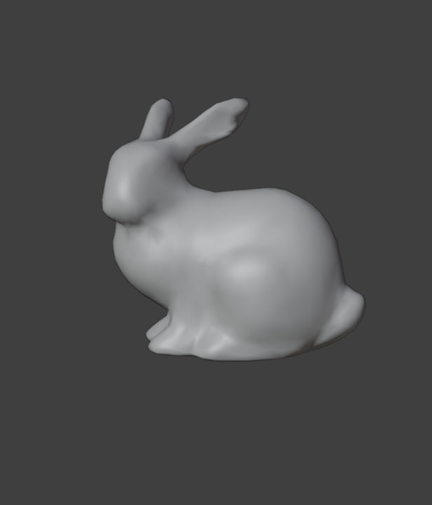
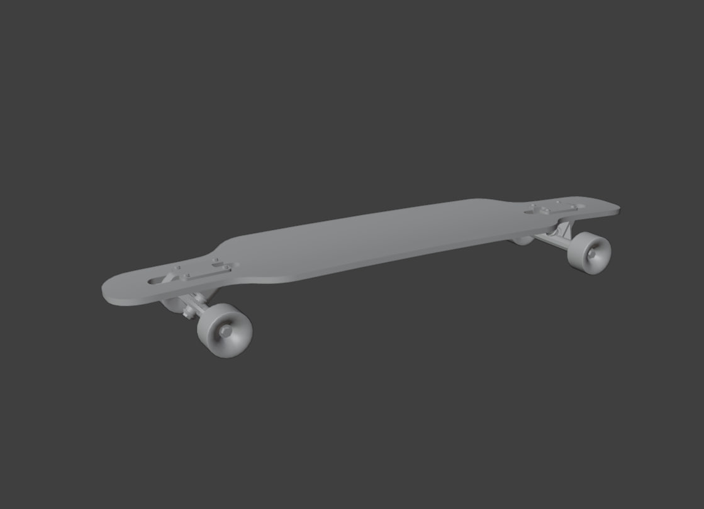

## User Documentation

> OBJ Transformation and Optimization Tool  

This program is a command-line C# application designed to process 3D model stored in [.obj format](https://en.wikipedia.org/wiki/Wavefront_.obj_file#:~:text=The%20OBJ%20file%20format%20is,of%20vertices%2C%20and%20texture%20vertices.) and apply several geometric and topological cleanup operations on the model and generate a new, optimized `.obj` file.
To view the resulting 3D model using the open-source 3D modeling application *Blender*, the path to the *Blender* application executable file will be provided as a command-line argument. Otherwise, the program will create the output file but will not preview the result.

### Requirements  
- **Visual Studio 2022**
- **Blender (optional)** – required only if you want to preview the output 3d model automatically  
- **Python (optional)** – required only for Blender preview 3d model  

### Download
``` bash
git clone https://github.com/Scroga/OBJ-File-Processor.git
cd OBJ-File-Processor
```

### Features

**Mesh Transformations**
The program supports mesh transformations, including translation, scaling, and rotation.  
Since an `.obj` file represents vertices as 3D vectors (and sometimes 4D vectors), a transformation matrix is applied to each vertex to transform the entire model.  
The matrix–vertex multiplication is parallelized to improve performance.

**Mesh Normalization**
The program supports mesh normalization. This operation scales the model to fit within a unit cube. It works by calculating a transformation matrix based on the bounding box of the 3D model, which is determined from the minimum and maximum vertex coordinates. Normalization standardizes the size of the 3D model and makes it more robust for further processing and visualization.

**Topology Cleanup**
The program supports topology cleanup. Specifically, it iterates through the mesh and removes all isolated vertices as well as any faces with zero area.  
Since an `.obj` file represents a model as a list of vertices and faces (where each face is defined by a set of vertex indices), a synchronization mechanism is applied during removal to preserve the correct index relations within the output `.obj` file.

## Data
The directory `Data/Meshes` contains several 3D models for demonstration purposes. The model `DirtyPerson.obj` is specifically provided to test the topology cleanup operation.






### Command line arguments

**Required arguments**

`-i/--input "path"` specifies path to the input `.obj` file. Example:

```
-i "C:\\.....\\OBJ-File-Processor\\Data\\Meshes\\Person.obj"
```

**Optional arguments**

`-o/--output "path"` specifies name to the output `.obj` file. Default is `output.obj` if not specified. Example:

```
-o "OutputMesh.obj"
```

`-b/--blender "path"` specifies the path to the `.exe` blender file. Example:

```
-b "C:\\.....\\blender.exe"
```

`-t/--translate x,y,z` specifies translation operation by the given vector. Example:

```
-t 10,-2,1.2
```

`-s/--scale x,y,z` specifies scaling operation by the given vector. Example:

```
-s 1,-2,1.2
```

`-s/--scale x,y,z` specifies rotation operation by the given vector, which defines the rotation along each axis in degrees. Example:

```
-r 120,-240,90
```

`-n/--normalize` flags set the normalization of 3d model. If the flag is not set, normalizaton is not applied. Example:

```
-n
```